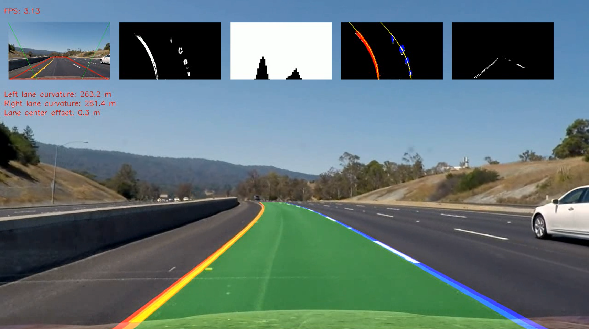

## Project Writeup


---
[](http://www.udacity.com/drive)
[](https://youtu.be/2PoAlSt-YRw)

**Advanced Lane Finding Project**

The goals / steps of this project are the following:

* Compute the camera calibration matrix and distortion coefficients given a set of chessboard images.
* Apply a distortion correction to raw images.
* Use color transforms, gradients, etc., to create a thresholded binary image.
* Apply a perspective transform to rectify binary image ("birds-eye view").
* Detect lane pixels and fit to find the lane boundary.
* Determine the curvature of the lane and vehicle position with respect to center.
* Warp the detected lane boundaries back onto the original image.
* Output visual display of the lane boundaries and numerical estimation of lane curvature and vehicle position.

[//]: # (Image References)

[image1]: ./camera_cal/calibration.png "Undistorted"
[image2]: ./output_files/camera_figures_straight_lines2.jpg "Road Transformed"
[image3]: ./output_files/color_figures_test2.jpg "Color thresholds"
[image4]: ./output_files/color_th_figures_test1.jpg "S threshold"
[image5]: ./output_files/gradient_th_figures_straight_lines2.jpg "Gradient thresholds"
[image6]: ./output_files/pipeline_figures_straight_lines1.jpg "Binary result"
[image7]: ./examples/color_fit_lines.jpg "Fit Visual"
[image8]: ./examples/example_output.jpg "Output"
[video1]: ./project_video.mp4 "Video"

## [Rubric](https://review.udacity.com/#!/rubrics/571/view) Points
 

---


# Camera Calibration


The code for the camera calibration can be found in `camera_calibration.py`. The calibration was done using OpenCV's `cv2.findChessboardCorners()` and `cv2.calibrateCamera()` functions. The `cv2.findChessboardCorners()` identifies "object points" in the (x, y, z) coordinates of the chessboard corners in the world. We are assuming that the chessboard is fixed on the (x, y) plane at z=0, such that the object points are the same for each calibration image.  Thus, `objp` is just a replicated array of coordinates, and `objpoints` will be appended with a copy of it every time I successfully detect all chessboard corners in a test image.  `imgpoints` will be appended with the (x, y) pixel position of each of the corners in the image plane with each successful chessboard detection.  

I then used the output `objpoints` and `imgpoints` to compute the camera calibration and distortion coefficients using the `cv2.calibrateCamera()` function.  I applied this distortion correction to the test image using the `cv2.undistort()` function and obtained this result: 

![alt text][image1]

---

# Pipeline (single images)

`process_test_images.py` file was used to determine the necessary image tranformations and filter parameters. The `process_test_images.py` uses the matplotlib's pyplot package.

### 1. Apply camera calibration and bird's view perspective transformations:

First, I applied the camera undistortion, based on the previously identified camera calibration matrix.
After that I selected the blue region for bird's perpective transform. To identify parallel lanes the blue region was transformed to the green region. 
I chose the hardcode the source and destination points in the following manner:

```python
src_region = np.array(
    [[[20, h],
    [550, 440],
    [w - 550, 440],
    [w - 20, h]]])

dst_region = np.array(
    [[[360, h],
    [0, 0],
    [w - 0, 0],
    [w - 360, h]]])
```

I verified that my perspective transform was working as expected by drawing the `src` and `dst` points onto a test image and its warped counterpart to verify that the lines appear parallel in the warped image.

![alt text][image2]

### 2. Apply different color filters. First row: RGB channels, second row: HLS channels, third row: HSV channels

These transformations was done using OpenCV's `cv2.cvtColor()` function.

![alt text][image3]

Based on the results HLS's S channel was used to identify lines. I applied a binary threshold on the S channel.

![alt text][image4]

### 3. Gradient threshdols. I applied several gradient threshold filters, and finally combined them with the following logic:
```python
combined[(gradx == 1) | ((grady == 1) & (mag_binary == 1) & (dir_binary == 1))] = 1
```

![alt text][image5]


### 4. Finally I combined the output of the gradient thresholds and the thresholded S channel into a single binary image:

![alt text][image6]

---

# Pipeline (video)

Based on the above thresholding, I built up the pipeline for video processing. It's not using matplotlib's pyplot interface anymore, only OpenCV functions.

The code is well documented in the `main.py` so this Readme only highlights the most important parts.
The `main.py` expects a single command line input `-i` that is a video or image file input. Example usage:
`python main.py -i "project_video.mp4"`

## Pipeline steps

#### 1. Apply camera undistortion:
```python
undistorted = utils.undistort_image(img, mtx, dist)
```
where utils is the `helper_functions.py` file. Let's dive into `utils.undistort_image()`:
```python
def undistort_image(img, mtx, dist):
    undist = cv2.undistort(img, mtx, dist, None, mtx)
    return undist
```
It simply uses OpenCV's undistort function.

#### 2. Calculate bird's view transformation matrices:
Based on `src_region` and `dst_region` we can simply calculate the distortion matrix and the inverse matrix:
```python
src_region = np.array([[[20, h], [550, 440], [w - 550, 440], [w - 20, h]]])
dst_region = np.array([[[360, h], [0, 0], [w - 0, 0], [w - 360, h]]])

M, M_inv = utils.calc_transformation_matrices(src_region, dst_region)
```

#### 3. Calculate a region mask around the `src_region`:
```python
mask = np.zeros((h, w), dtype=np.uint8)
ignore_mask_color = 255
cv2.fillPoly(mask, src_region, ignore_mask_color)
```

#### 4. Apply a special color filter that extracts the white and yellow lane lines. But first, I apply a sharpening filter on the image because it results much better output:
```python
sharp = utils.sharpen(undistorted)
combined_color = utils.lane_color_filter(sharp)
```

#### 5. Apply different gradient thresholding filters and combine the results. I didn't use gradient in y direction because there isn't any useful information I could extract from it. Finally apply the region mask on it and combine with the previous filtered S channel:
```python
gradx = utils.abs_sobel_thresh(undistorted, orient='x', sobel_kernel=ksize, thresh=(70, 255))
mag_binary = utils.mag_thresh(undistorted, sobel_kernel=ksize, mag_thresh=(100, 255))
dir_binary = utils.dir_threshold(undistorted, sobel_kernel=ksize, thresh=(0.8, 1.1))

combined = np.zeros((h, w), dtype=np.uint8)
combined[(gradx == 1) | ((mag_binary == 1) & (dir_binary == 1))] = 1

masked_combined = cv2.bitwise_and(combined, mask)

result, result_binary = utils.stack_binaries(masked_combined, masked_S)
```

#### 6. Transform the binary image to bird's perspective and calculate the histogram of the bottom half of the image:
```python
birdseye = utils.warp_transform(result_binary*255, M)
histogram = utils.hist(birdseye/255)
```

#### 7. If the lanes are reliable we can search the polynomial in the near range of the previous polynomial for both lines:
```python
if left_lane.reliable and right_lane.reliable:
    leftx, lefty = utils.search_around_poly(birdseye, left_lane.get_poly())
    rightx, righty = utils.search_around_poly(birdseye, right_lane.get_poly())
```

#### 8. If the lanes are NOT reliable we have to find the lines from scratch:
```python
leftx, lefty, rightx, righty, out_img = utils.find_lane_pixels(birdseye)
```

#### 9. Let's perform sanity checks on the lines and the lane. I defined the following checks:
- If there aren't enough data points in the upper region of the image, the interpolation will become unreliable.
- If the curvature of the two lane lines are in different direction
- If there is too big width difference between the lane start and lane end
- If the detected lane is too thin
- If the detected lane is too wide

If any of the sanity checks fail I recover the previous detected lane sample and mark the lines as unreliable.

#### 10. Finally color line pixels and transform the lane area back to the original image:
```python
# draw the lane finding results on the image
out_img = utils.draw_lane_pixels(out_img, left_lane, color=(0, 0, 255))
out_img = utils.draw_lane_pixels(out_img, right_lane)
out_img = utils.draw_poly(out_img, left_lane, width=5)
out_img = utils.draw_poly(out_img, right_lane, width=5)

# un-warp the bird's view lane and overlay to the original image
result = utils.draw_lane_area(birdseye, undistorted, left_lane, right_lane, M_inv)
result = utils.draw_lane_lines(birdseye, result, left_lane, right_lane, M_inv, 10)
```

#### 11. To include more visual information on the video you can add small images to the top row of the final image:
```python
result = utils.add_small_pictures(result, [region_img, birdseye, hist, out_img, masked_combined*255])
```
[](https://youtu.be/2PoAlSt-YRw)


---

## Discussion

There are several issues with this type of lane detection algoritm, I collect the major issues I found during the implementation:
### 1. It's super slow. Really, this algorith can process cca. 3 frames per second with the 720p resolution
This can be slightly increase with optimizations of the existing algorithm, but it's difficult to reach higher performance in python.
Filters should executed in multiple threads and join these threads when both results are needed.
### 2. Parameters are too sensitive for road color, lighting, lane color changes.
It's not possible to find a robust parameter set that rules them all. The final algirithm easily becomes too complex that's hard to validate
### 3. Perspective transformation is very sensitive for the camera tilt angle
Tilt angle can change easily during driving (acceleration, deccelartion, road surface changes). To compensate this tilt deviation we need the camera's tilt angle that's easily accessible from a MEMS accelerometer. However the currently implemented hardcoded transformation matrices are not scalable for real use

### Overall verdict: I suggest to use a semantic segmentation based neural network for this purpose that's much faster and more reliable.
